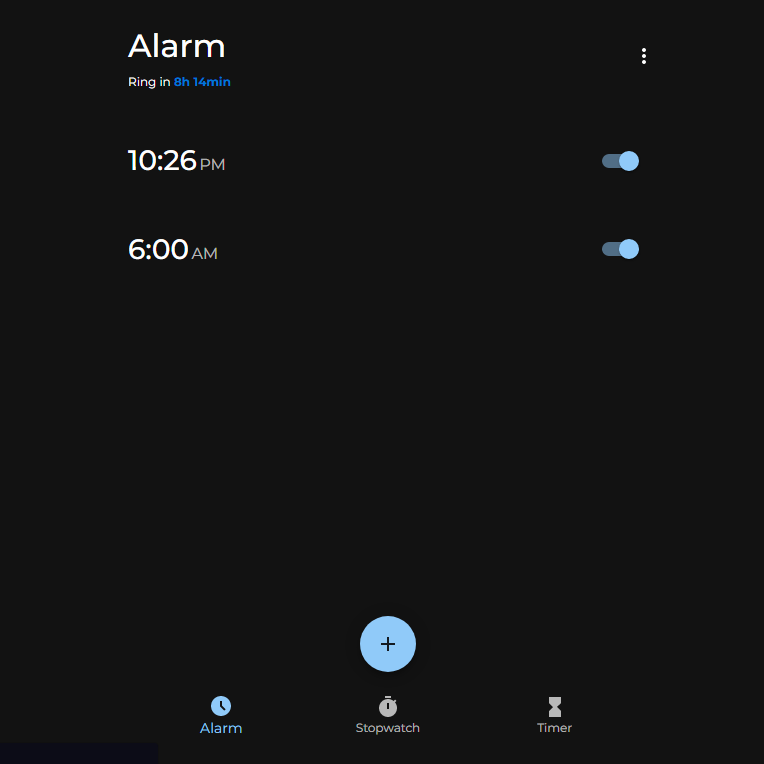
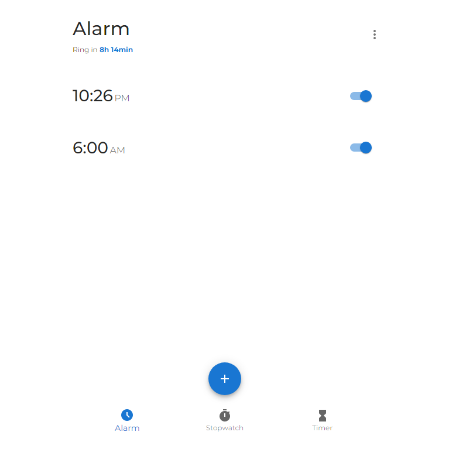
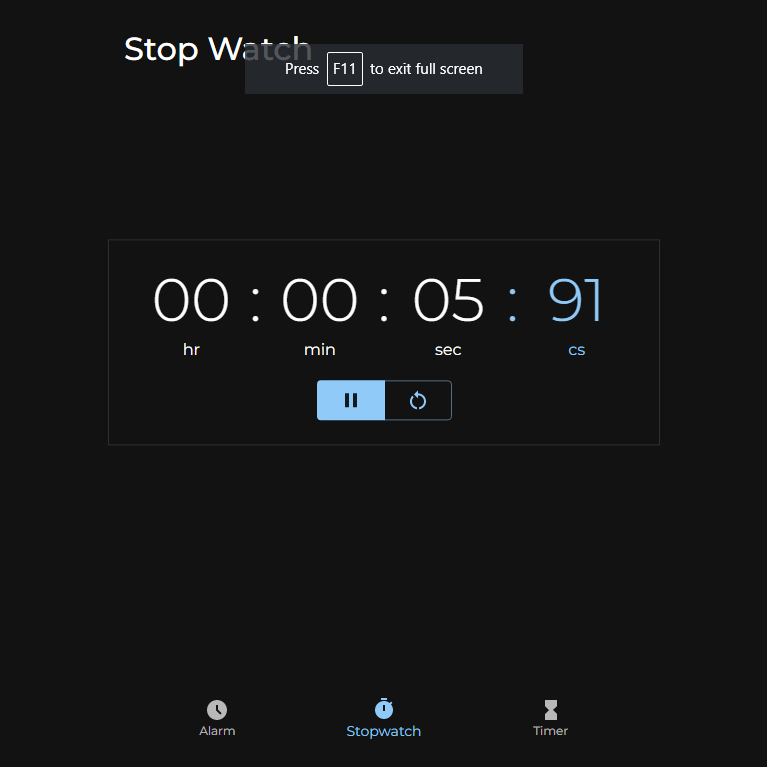
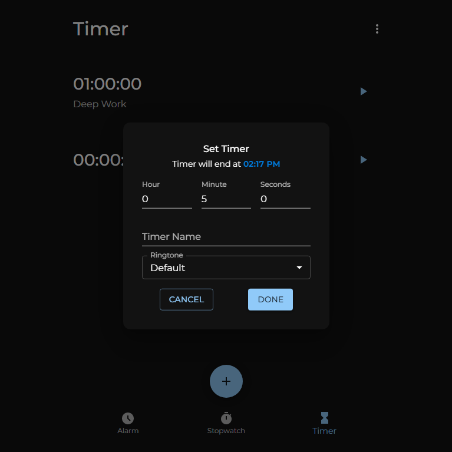

# Alarm Clock

Welcome to the Alarm Clock! This is a versatile Alarm Clock application that allows you to set alarms, timers, and use stopwatches. It also provides a light and dark theme option for personalized styling.

## Features

- Alarms: Set multiple alarms with customizable labels, notification sounds, and ringtone selection.
- Snooze Functionality: Snooze alarms for 5 minutes after they ring.
- Time Left Indicator: The app displays the remaining time until an alarm rings.
- Timers: Set countdown timers for various purposes, such as cooking, workouts, or reminders.
- Stopwatches: Use stopwatches to track time accurately for any activity or event.
- Light and Dark Themes: Choose between a light or dark theme to suit your preference and environment.
- Customizable Settings: Personalize the app by adjusting settings such as alarm sound, ringtone, theme, and more.

## Technologies Used

The Alarm Clock is built using the following technologies and frameworks:

- Reactjs, HTML, CSS, and JavaScript for the frontend
- [Material-UI](https://material-ui.com) for UI components and styling
- [mui-time-picker](https://www.npmjs.com/package/mui-time-picker) for time picker functionality

## Usage

- Upon opening the Alarm Clock, you will see the main screen displaying the current time and date.
- Navigate through the app using the menu or tabs to access the desired features: alarms, timers, or stopwatches.
- Set alarms by specifying the time, label, sound, and ringtone. The app will trigger a notification at the specified time and allow snoozing.
- Create timers by setting the countdown duration and label. The app will notify you when the timer ends.
- Use stopwatches to measure elapsed time. Start, pause, or reset the stopwatch as needed.
- Adjust the app's settings to customize alarm sounds, ringtones, theme preferences, or any other available options.

## Screenshots

## Contributing

Contributions are welcome! If you'd like to contribute to the Alarm Clock, please follow these steps:

1. Fork the repository.
2. Create a new branch for your feature or bug fix.
3. Make the necessary changes and commit them.
4. Push your changes to your fork.
5. Submit a pull request to the main repository.

Please ensure that your code follows the project's coding guidelines and includes appropriate tests (if applicable).

## Contact

If you have any questions, suggestions, or feedback, please feel free to reach out to Email: utkarshv955@gmail.com. We'd love to hear from you!

Enjoy using the Alarm Clock!
